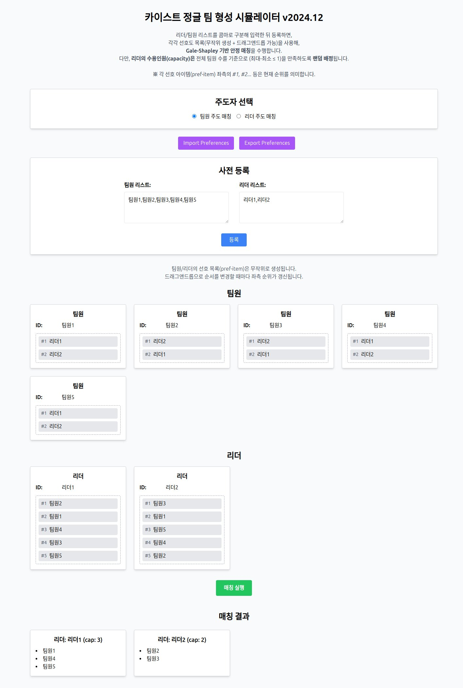

# jungle-team-simulator

**Jungle Team Simulator** is a web application that helps you form teams using the Gale-Shapley stable matching algorithm. Easily input team members and leaders, set their preferences, and generate optimal team matches.

## Features

- **Register Teams and Leaders:** Input and manage team members and leaders effortlessly.
- **Set Preferences:** Customize preferences with a simple drag-and-drop interface.
- **Stable Matching:** Generate stable team matches using the Gale-Shapley algorithm.
- **Import/Export Preferences:** Save and load your preferences via JSON files.
- **Responsive Design:** Access the simulator on any device, whether it's a desktop, tablet, or smartphone.

## Installation

### Prerequisites

- **Node.js** (v18 or higher)

### Steps

1. **Clone the Repository**

   ```bash
   git clone https://github.com/hjyoon/jungle-team-simulator.git
   cd jungle-team-simulator
   ```

2. **Install Dependencies**

   Copy the `.env.example` file to `.env` and set the `APP_PORT`:

   ```bash
   npm install
   ```

3. Configure Environment Variables

   ```bash
   cp .env.example .env
   ```

   Open the `.env` file and set the `APP_PORT`:

   ```bash
   APP_PORT=3000
   ```

## Usage

```bash
./run.sh
```

The application will be accessible at http://localhost:3000.

## Result with a Image



## Contributing

Contributions are always welcome!

## License

This project is licensed under the MIT License - see the [LICENSE](LICENSE) file for details.
